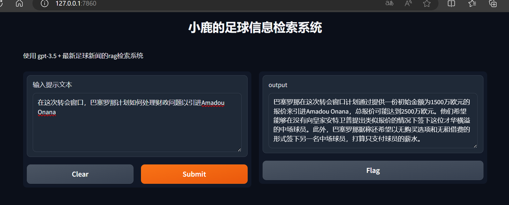
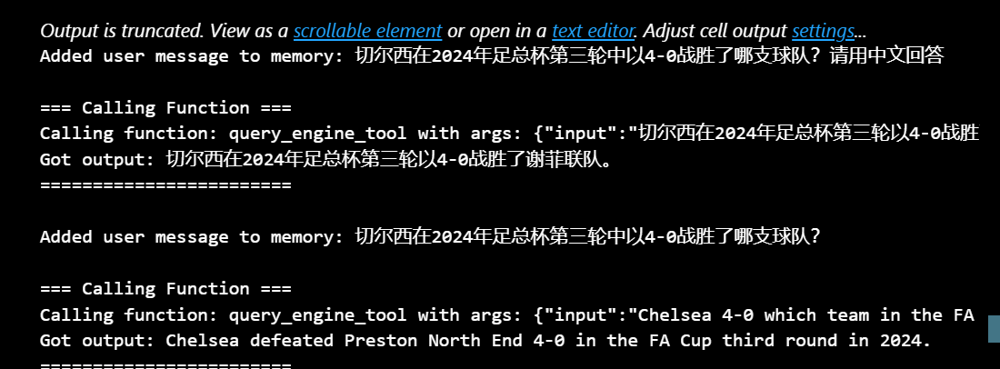
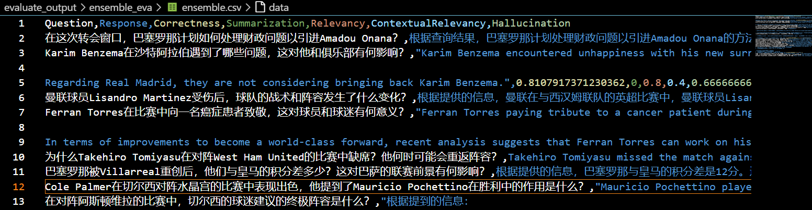
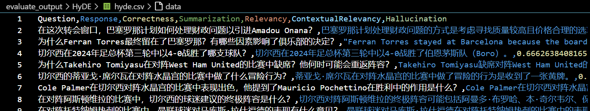
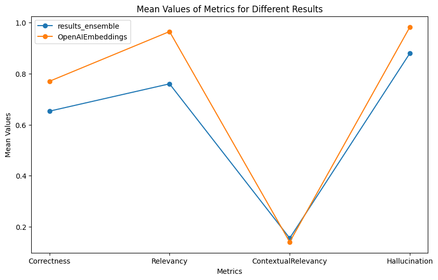

## <center> A Football Domain-Specific Knowledge Dialogue Model with Enhanced Retrieval </center>
### <center>Information Retrieval - Final Project</center>

### 1. Project Requirements

Large language models (LLMs), such as ChatGPT, have demonstrated powerful capabilities in natural language understanding and generation. Retrieval-Augmented Generation (RAG) is a technique that retrieves relevant information from external knowledge sources before generating responses using LLMs. This allows LLMs to generate more accurate and contextually relevant answers by leveraging external knowledge resources.

This project requires constructing a system capable of answering 2024 football news questions using the `LlamaIndex` framework, combining large language models with RAG techniques.


Specific requirements include:

> - Dataset: Use the provided dataset of 2024 football news articles (`data.csv`).
> - Basic RAG System Implementation: Use the `LlamaIndex` framework to construct a basic RAG system, including indexing, retrieval, and generation steps.
> - Improvements and Optimization: Experiment with different chunking strategies and sizes, embedding models, multi-level indexing, query rewriting, hybrid retrieval, and re-ranking to optimize system performance.
> - Evaluation: Design experiments to evaluate the basic and improved systems, providing performance metrics and examples.

### 2. Implementation Approach

Based on the project requirements, the implementation approach is outlined as follows:

.png>)

First, a simple dialogue model is built using `LlamaIndex`. Optimization is then performed in three areas: indexing methods, hybrid retrieval, and query rewriting. Finally, the responses from the basic model and the optimized model are evaluated using four metrics within the `DeepEval` framework to compare their performance.

### 3. Basic Dialogue Model with `LlamaIndex`

#### 1. OpenAI API

```python
import os
from dotenv import load_dotenv

OPENAI_API_KEY = 'OPENAI_API_KEY' 
os.environ['OPENAI_API_KEY'] = 'OPENAI_API_KEY' 

load_dotenv()
```

#### 2. Dataset Preparation

Load the `documents` by reading the files using the `SimpleDirectoryReader` method and saving them as `documents`.

```python
import os
import gradio as gr
import openai

from llama_index.core import VectorStoreIndex,SimpleDirectoryReader,
ServiceContext,PromptTemplate
from llama_index.core.schema import IndexNode

from llama_index.core import (
    GPTKeywordTableIndex,
    SimpleDirectoryReader,
    ServiceContext
)

documents = SimpleDirectoryReader(input_dir='./data').load_data()
```

#### 3. Create Index Using `OpenAIEmbeddings`

Use the most basic indexing method, `OpenAIEmbeddings`. This process will automatically create `nodes` from the `documents`.

```python
from llama_index.core import VectorStoreIndex,DocumentSummaryIndex
from langchain_openai import OpenAIEmbeddings

# OpenAIEmbeddings()  
print("OpenAIEmbeddings:")
index_OpenAIEmbeddings = VectorStoreIndex.from_documents(documents = documents,
 embedding = OpenAIEmbeddings(), show_progress = 1)
```

Indexing process:


#### 4. Generate Responses with the RAG Retrieval Engine `get_response(query)`

```python
# Different embedding-based engines can be used in this section
query_engine = index_OpenAIEmbeddings.as_chat_engine(verbose=True)

# Define the get_response function
def get_response(query):
    response = query_engine.query(query)
    return response
```

#### 5. `Gradio` Interface

```python
import gradio as gr
from gradio.components import Textbox

# Create the Gradio interface
iface = gr.Interface(
    fn=get_response,
    inputs=gr.components.Textbox(lines=5, label="Input your query"),
    outputs="text",
    title="Luxinai's Football Information Retrieval System",
    description="RAG-based system using GPT-3.5 + the latest football news"
)

# Launch the Gradio interface
iface.launch()
```

【Interface and Q&A Effect】Input a question, click the `Submit` button to submit the query, and the engine will display the response after enhanced retrieval in the `output` dialogue box on the right. Users can click `Flagged` to save both the query and the engine's response to a backend file. Users can also click the `Clear` button on the left to reset the input and ask a new question.


```
### Four: Model Optimization  
#### 1. Two Different `HuggingFace` Embedding Models  
##### (1) `bge-large-zh-v1.5`  

  

  

Define `index_bge_large_zh` as the index name using this embedding model.  

```python  
# bge-large-zh-v1.5  
print("bge-large-zh-v1.5:")  
bge_embeddings = HuggingFaceBgeEmbeddings(model_name="BAAI/bge-large-zh-v1.5")  
index_bge_large_zh = VectorStoreIndex.from_documents(documents = documents,  
                embedding = bge_embeddings, show_progress = 1)  
```  
Example `response` generation:  

##### (2) `bge-M3`  

`BGE-M3` is the first semantic vector model that integrates three technical features: Multi-Linguality, Multi-Granularity, and Multi-Functionality, greatly improving the usability of semantic vector models in real-world applications. Currently, `BGE-M3` is fully open-sourced to the community.  

Define `index_bge_M3` as the index name using this embedding model.  

```python  
# bge-M3  
print("bge-M3:")  
bgeM3_embeddings = HuggingFaceBgeEmbeddings(model_name="BAAI/bge-M3")  
index_bge_M3 = VectorStoreIndex.from_documents(documents = documents,  
                embedding = bgeM3_embeddings, show_progress = 1)  
```  
Example `response` generation: It can be seen that when asked "What kind of model are you?", the enhanced engine adds football-related private domain knowledge.  

  

#### 2. Hybrid Retrieval  
##### (1) Preprocess the Document Set  
Convert `documents` into a format suitable for `.from_texts()` initialization method of `BM25Retriever` and `FAISS`.  

```python  
# Define an empty text list  
doc_texts = []  
splitted_texts = []  

# Iterate through each document object to retrieve text content and metadata  
for i, doc in enumerate(documents):  
    text = doc.text  # Use the text attribute to get the content  
    if text:  
        doc_texts.append(text)  
    else:  
        doc_texts.append("")  # Add an empty string if the content is empty  

# Split each text content by "http"  
for text in doc_texts:  
    splitted_texts.extend(text.split("http"))  

# Convert documents into a list of texts and metadata  
doc_metadatas = [{"source": i} for i in range(len(splitted_texts))]  
```  

##### (2) Define Sparse Retrieval `BM25Retriever` and Dense Retrieval `FAISS`  

```python  
# Attempt hybrid retrieval  
from langchain_community.retrievers import BM25Retriever  
from langchain_community.vectorstores import FAISS  
from langchain_openai import OpenAIEmbeddings  

# Initialize BM25 retriever  
bm25_retriever = BM25Retriever.from_texts(splitted_texts, metadatas = doc_metadatas)  
bm25_retriever.k = 3  

# Initialize FAISS retriever  
embedding = OpenAIEmbeddings()  
faiss_vectorstore = FAISS.from_texts(splitted_texts, embedding, metadatas=doc_metadatas)  

# Convert FAISS vector store into a retriever  
faiss_retriever = faiss_vectorstore.as_retriever(search_kwargs={"k": 3})  
```  

##### (3) Define Hybrid Retrieval `EnsembleRetriever`  

```python  
# Attempt hybrid retrieval  
from langchain.retrievers import EnsembleRetriever  
from langchain_openai import OpenAIEmbeddings  

# Initialize Ensemble Retriever  
ensemble_retriever = EnsembleRetriever(  
    retrievers=[bm25_retriever, faiss_retriever], weights=[0.5, 0.5]  
)  
```  

##### (4) Use Hybrid Retrieval to Find Documents Relevant to the Query  

```python  
# Use Ensemble Retriever for retrieval  
query = "How did Manchester United players perform in their 3-0 victory over West Ham?"  
docs = ensemble_retriever.invoke(query)  

for doc in docs:  
    print(f"Document ID: {doc.lc_id}")  
    print(f"Content: {doc.page_content}")  
    print("\n---\n")  
```  

Retrieved documents:  

  

  

##### (5) Combine Hybrid Retrieval Results with the Question and Generate a `response`  

```python  
# Combine retrieved document content into a string and pass it to query_engine  
doc_contents = "\n".join([doc.page_content for doc in docs])  

combined_query = f"My question is: {query}. I know the following information: {doc_contents}.  
                                Please answer based on this content."  

# Use query_engine for summarization and response generation  
response = query_engine.query(combined_query)  

# Print the result  
print(response)  
```  

Query text generation process:  
  

Returned `response`:  

  

> In Manchester United's 3-0 victory over West Ham, the players performed well and secured the win, with Rashford, Højlund, and McTominay scoring goals. Additionally, Rashford's performance was remarkable, as he either scored or assisted in his last four Premier League matches. Højlund was also in good form, contributing to six goals in five games across competitions. Despite some defensive issues, the team managed to field a strong lineup, with key players returning, and achieved a crucial win. In this match, West Ham players did not perform well, as it mentions that the actual reverse match at London Stadium saw West Ham win 2-0.

#### 3. `HyDE` Query Rewriting  

The core idea behind the `HyDE` principle is to optimize query representation by generating hypothetical documents, thereby improving the relevance and accuracy of retrieval results.  

  

Implement query rewriting optimization using the `HyDE` model:  

```python  
# Results of HyDE query rewriting  
from llama_index.core.indices.query.query_transform import HyDEQueryTransform  
from llama_index.core.query_engine import TransformQueryEngine  

query_engine = index_bge_M3.as_chat_engine(verbose=True)  

# hyde query rewriting  
hyde = HyDEQueryTransform(include_original=True)  
hyde_query_engine = TransformQueryEngine(query_engine, hyde)  
response = hyde_query_engine.query("How did Manchester United players perform in their 3-0 victory over West Ham?")  
```  

Comparison of `response` with and without query rewriting:  

  

Specific `response` content seems not to show improvement.  

【Base Query】  
> Manchester United players performed well in their 3-0 victory over West Ham. Rashford and Højlund scored early, and McTominay added a third goal as a substitute in the second half. Additionally, Kobbie Mainoo scored in injury time to secure the win.  

【HyDE Query】  
> Manchester United players performed well in their 3-0 victory over West Ham, controlling the match and creating opportunities. Rashford and Højlund scored early. Despite some defensive issues, they comfortably secured the win.

### IV. Model Optimization

#### 1. Two Different HuggingFace Embedding Models

##### (1) `bge-large-zh-v1.5`

  
  

Define `index_bge_large_zh` as the index name using this embedding model.

```python
# bge-large-zh-v1.5
print("bge-large-zh-v1.5:")
bge_embeddings = HuggingFaceBgeEmbeddings(model_name="BAAI/bge-large-zh-v1.5")
index_bge_large_zh = VectorStoreIndex.from_documents(
    documents=documents,
    embedding=bge_embeddings,
    show_progress=1
)
```

Sample `response` generation:  

##### (2) `bge-M3`

`BGE-M3` is the first semantic vector model to integrate three major features: Multi-Linguality, Multi-Granularity, and Multi-Functionality. It significantly enhances real-world usability and has been fully open-sourced to the community.

Define `index_bge_M3` as the index name using this embedding model.

```python
# bge-M3
print("bge-M3:")
bgeM3_embeddings = HuggingFaceBgeEmbeddings(model_name="BAAI/bge-M3")
index_bge_M3 = VectorStoreIndex.from_documents(
    documents=documents,
    embedding=bgeM3_embeddings,
    show_progress=1
)
```

Sample `response` generation shows that when asked, "What model are you?" the enhanced engine incorporates football-related domain knowledge.  


#### 2. Hybrid Retrieval

##### (1) Preprocessing the Document Set

Convert `documents` into a format compatible with the `.from_texts()` initialization method of `BM25Retriever` and `FAISS`.

```python
# Define an empty text list
doc_texts = []
splitted_texts = []

# Extract text content and metadata from each document
for i, doc in enumerate(documents):
    text = doc.text  # Get text content
    doc_texts.append(text if text else "")

# Split each text based on "http"
for text in doc_texts:
    splitted_texts.extend(text.split("http"))

# Create metadata for each document
doc_metadatas = [{"source": i} for i in range(len(splitted_texts))]
```

##### (2) Defining Sparse and Dense Retrieval with `BM25Retriever` and `FAISS`

```python
# Hybrid retrieval setup
from langchain_community.retrievers import BM25Retriever
from langchain_community.vectorstores import FAISS
from langchain_openai import OpenAIEmbeddings

# Initialize BM25 Retriever
bm25_retriever = BM25Retriever.from_texts(splitted_texts, metadatas=doc_metadatas)
bm25_retriever.k = 3

# Initialize FAISS Retriever
embedding = OpenAIEmbeddings()
faiss_vectorstore = FAISS.from_texts(splitted_texts, embedding, metadatas=doc_metadatas)
faiss_retriever = faiss_vectorstore.as_retriever(search_kwargs={"k": 3})
```

##### (3) Defining the `EnsembleRetriever`

```python
# Ensemble Retrieval
from langchain.retrievers import EnsembleRetriever

ensemble_retriever = EnsembleRetriever(
    retrievers=[bm25_retriever, faiss_retriever],
    weights=[0.5, 0.5]
)
```

##### (4) Using Hybrid Retrieval to Find Relevant Documents

```python
# Use Ensemble Retriever for query
query = "How did Manchester United players perform in their 3-0 victory over West Ham?"
docs = ensemble_retriever.invoke(query)

for doc in docs:
    print(f"Document ID: {doc.lc_id}")
    print(f"Content: {doc.page_content}\n---\n")
```

Relevant documents retrieved:  
  
  

##### (5) Combining Hybrid Retrieval Results with Query to Generate `response`

```python
# Combine retrieved content with the query
doc_contents = "\n".join([doc.page_content for doc in docs])

combined_query = f"My question is: {query}. Based on the following information: {doc_contents}, please answer."

# Generate summary and response using query engine
response = query_engine.query(combined_query)
print(response)
```

Query-to-text generation process:  
  

Generated `response`:  


---

#### 3. `HyDE` Query Rewriting

The core idea of `HyDE` (Hypothetical Document Embeddings) is to optimize query representation by generating hypothetical documents, improving the relevance and accuracy of retrieval results.  

  

Implementing query rewriting with `HyDE`:

```python
from llama_index.core.indices.query.query_transform import HyDEQueryTransform
from llama_index.core.query_engine import TransformQueryEngine

query_engine = index_bge_M3.as_chat_engine(verbose=True)

# Apply HyDE Query Rewriting
hyde = HyDEQueryTransform(include_original=True)
hyde_query_engine = TransformQueryEngine(query_engine, hyde)
response = hyde_query_engine.query("How did Manchester United players perform in their 3-0 victory over West Ham?")
```

Comparison of rewritten and base query responses:  
  

Responses indicate limited improvement:  

**Base Query Response**:  
> Manchester United players performed well in their 3-0 victory over West Ham. Rashford, Højlund, and McTominay scored, securing the win.

**HyDE Query Response**:  
> Manchester United players performed well, controlling the match and creating opportunities. Rashford and Højlund scored early goals. Despite defensive issues, the team secured a comfortable victory.

---

#### 4. `DeepEval` Evaluation Metrics Selection

##### (1) `G-Eval`

Definition: Evaluates factual correctness of the `actual_output` against the `expected_output`.

```python
from deepeval.metrics import GEval
from deepeval.test_case import LLMTestCaseParams

correctness_metric = GEval(
    name="Correctness",
    model="gpt-3.5-turbo",
    criteria="Determine whether the actual output is factually correct based on the expected output.",
    evaluation_params=[LLMTestCaseParams.INPUT, LLMTestCaseParams.ACTUAL_OUTPUT],
)
```

##### (2) `Answer Relevancy`

Definition: Measures the relevance of the `actual_output` compared to the provided `input`.  
Formula:  
\[
Answer\ Relevancy = \frac{\text{Number of Relevant Statements}}{\text{Total Number of Statements}}
\]

```python
from deepeval.metrics import AnswerRelevancyMetric

Relevancy_metric = AnswerRelevancyMetric(
    threshold=0.7,
    model="gpt-3.5-turbo",
    include_reason=True
)
```

##### (3) `Contextual Relevancy`

Definition: Measures the relevance of the `retrieval_context` for a given `input`.  

```python
from deepeval.metrics import ContextualRelevancyMetric

ContextualRelevancy_metric = ContextualRelevancyMetric(
    threshold=0.7,
    model="gpt-3.5-turbo",
    include_reason=0
)
```

##### (4) `Hallucination`

The official documentation describes the `Hallucination` metric as follows:

> The hallucination metric determines whether your LLM generates factually correct information by comparing the `actual_output` to the `provided context`.

Calculation formula:

$$ Hallucination = \frac{Number of Contradicted Contexts}{Total Number of Contexts} $$

Define the `Contextual Relevancy` matrix:

```python
from deepeval.metrics import HallucinationMetric

Hallucination_metric = HallucinationMetric(threshold=0.5, model="gpt-3.5-turbo")
```

#### 3. Defining CustomLLM

```python
import gradio as gr
from deepeval.models.base_model import DeepEvalBaseLLM

# 定义自定义模型
class CustomLLM(DeepEvalBaseLLM):
    def __init__(self, query_engine):
        self.query_engine = query_engine

    def load_model(self):
        return self.query_engine

    def generate(self, prompt: str) -> str:
        response = self.query_engine.query(prompt)
        return response
    
    def query(self, prompt: str) -> str:
        response = self.query_engine.query(prompt)
        return response

    async def a_generate(self, prompt: str) -> str:
        return self.generate(prompt)
    
    def get_model_name(self):
        return "Custom OpenAI Embedding Model"
```


#### 4. Testing the model with three different embeddings
##### （1）Building the Index
```python
from llama_index.core import VectorStoreIndex,DocumentSummaryIndex
# from haystack.indexing.vector_store import VectorStoreIndex
from llama_index.core import KnowledgeGraphIndex
from langchain.vectorstores import FAISS
from langchain_openai import OpenAIEmbeddings

# OpenAIEmbeddings()  
print("OpenAIEmbeddings:")
index_OpenAIEmbeddings = VectorStoreIndex.from_documents(documents = documents, 
StorageContext = True, embedding = OpenAIEmbeddings(), show_progress = 1)

from langchain.embeddings import HuggingFaceBgeEmbeddings

# bge-large-zh-v1.5
print("bge-large-zh-v1.5:")
bge_embeddings = HuggingFaceBgeEmbeddings(model_name="BAAI/bge-large-zh-v1.5")
index_bge_large_zh = VectorStoreIndex.from_documents(
  documents = documents, embedding = bge_embeddings, show_progress = 1)

# bge-M3
print("bge-M3:")
bgeM3_embeddings = HuggingFaceBgeEmbeddings(model_name="BAAI/bge-M3")
index_bge_M3 = VectorStoreIndex.from_documents(documents = documents, 
embedding = bgeM3_embeddings, show_progress = 1)
```

##### （2）Defining `evaluate_responses` to test the outcome
```python
# 准备函数retrieval_context(nodes_r)，用来返回、拼接检索到的文档内容
def retrieval_context(nodes_r):
    context_template = " "
    context_ls = []
    for node_r in nodes_r:
        context_template = context_template + node_r.text+"\n"
        context_ls.append(node_r.text)
        
    return context_template,context_ls
```

```python
from deepeval.metrics import ToxicityMetric
from deepeval.test_case import LLMTestCase

def evaluate_responses(model, questions, expected_outputs):
    
    assert len(questions) == len(expected_outputs),
     "questions 和 expected_outputs 列表长度不一致"
    
    # 调用上面矩阵来求各个评估指标
    Correctness = correctness_metric
    Summarization = Summarization_metric
    Relevancy = Relevancy_metric
    ContextualRelevancy = Contex
```

### 5. Utilizing `DeepEval` to Evaluate the System

#### 1. Testing Approach
The testing involves evaluating three variables: which embedding to use, whether to use hybrid retrieval, and whether to apply query rewriting. Five metrics will be used to assess all combinations of these three variables.

- **Testing Embeddings**  
**Controlled Variables**: No hybrid retrieval, no query rewriting  
**Test**: Switch between `index_OpenAIEmbeddings`, `index_bge_large_zh`, and `index_bge_M3` and assess the metrics.

- **Testing Hybrid Retrieval**  
**Controlled Variables**: Use `index_OpenAIEmbeddings`, no query rewriting  
**Test**: Whether to use hybrid retrieval.

- **Testing Query Rewriting**  
**Controlled Variables**: Use `index_OpenAIEmbeddings`, no hybrid retrieval  
**Test**: Whether to apply query rewriting.

#### 2. Test Dataset Preparation
For the original dataset of news articles, 20 detailed questions and answers were generated using OpenAI's `gpt-4o` model. The questions are stored as `questions` and the answers as `expected_outputs`. The choice of 20 questions is due to OpenAI's API rate limits, and given the slow pace of the metric calculation process, a question set of 20 was deemed appropriate considering both economic and time costs.

Question Set `query_new`(all in Chinese, beacuse the project was originally finished in Chinese):
>- 在这次转会窗口，巴塞罗那计划如何处理财政问题以引进Amadou Onana？
>- Karim Benzema在沙特阿拉伯遇到了哪些问题，这对他和俱乐部有何影响？
>- 曼联球员Lisandro Martinez受伤后，球队的战术和阵容发生了什么变化？
>- Ferran Torres在比赛中向一名癌症患者致敬，这对球员和球迷有何意义？
>- 为什么Takehiro Tomiyasu在对阵West Ham United的比赛中缺席？他何时可能会重返阵容？
>- 巴塞罗那被Villarreal重创后，他们与皇马的积分差多少？这对巴萨的联赛前景有何影响？
>- Cole Palmer在切尔西对阵水晶宫的比赛中表现出色，他提到了Mauricio Pochettino在胜利中的作用是什么？
>- 在对阵阿斯顿维拉的比赛中，切尔西的球迷建议的终极阵容是什么？
>- 在对阵托特纳姆热刺的比赛中，曼联球迷对马库斯·拉什福德的表现有什么意见？
>- 吉安路易吉·布冯表示在他职业生涯中哪个前锋对他造成了最大的痛苦？
>- 切尔西的蒂亚戈·席尔瓦在对阵水晶宫的比赛中做了什么冒险行为？
>- 2023年斯坦福桥的比赛中，哪位球员在第71分钟进球使阿斯顿维拉战胜切尔西？
>- 切尔西在2024年足总杯第三轮中以4-0战胜了哪支球队？
>- 在2024年2月初对阵埃弗顿的比赛中，阿斯顿维拉取得了什么结果？
>- 切尔西在2024年与阿斯顿维拉的比赛中，预计最有可能的比分是什么？
>- 2024年利物浦对阵阿森纳的比赛中，克洛普是否对达尔文·努涅斯不上场感到后悔？
>- 克洛普在2024年对阵阿森纳的比赛中，提到球队应该如何提高？
>- 康纳·加拉格尔在2024年对阵水晶宫的比赛中打进了多少球？
>- 康纳·加拉格尔在对阵水晶宫的比赛中，被评为比赛最佳球员后提到了什么关于主教练的战术调整？
>- 梅西、苏亚雷斯、阿尔巴和布斯克茨在2024年为哪支球队展示了他们的出色配合？

Answer SET`expected_output`（data type:`list`）：

>- 巴塞罗那计划通过出售一些球员来筹集资金，可能会将Frenkie De Jong和Ronald Araujo列入出售名单，以便购买Amadou Onana。
>- Karim Benzema与Al Ittihad的主教练Marcelo Gallardo发生了冲突，这可能对他在俱乐部的未来产生影响，并可能影响球队的氛围和战绩。
>- Lisandro Martinez受伤后，曼联可能需要调整他们的防守组织和中场配置，可能会影响他们在比赛中的表现和战术风格。
>- Ferran Torres的这个举动展现了他的人道主义精神和对球迷的关怀，这可能会赢得更多球迷的支持和尊重，同时也为球迷带来了温暖和鼓舞。
>- Takehiro Tomiyasu因为国家队比赛后出现了小伤，所以缺席了比赛。目前尚不清楚他何时可以重返阵容，但希望他的伤势只是轻微的问题。
>- 巴塞罗那在主场被Villarreal以5-3击败，导致他们与皇马的积分差距达到了10分。这对巴萨本赛季的联赛前景造成了不小的影响，使得他们的冠军希望受到挑战。
>- Cole Palmer提到了Mauricio Pochettino在胜利中的作用，称赞了他的指导和支持，认为Pochettino对球队的凝聚力和信心给予了很大的帮助。这表明了Pochettino在切尔西的作用和影响。
>- Petrovic；迪萨西、蒂亚戈·席尔瓦、巴迪亚希尔；奇尔维尔、凯塞多、恩佐、古斯托；帕尔默、杰克逊、恩昆库。tualRelevancy_metric
    Hallucination = Hallucination_metric
    
    results = []

    for i, question in enumerate(questions):
        # 生成 response
        response = model.generate(question)
        
        # 求context内容
        retriever_base = index_OpenAIEmbeddings.as_retriever(similarity_top_k=5)
        nodes_r = retriever_base.retrieve(question)
        context,context_ls = retrieval_context(nodes_r)
        
        # 求对应 expected_output
        expected_output = expected_outputs[i]
        
        # 求各种指标
        test_case = LLMTestCase(input=question, actual_output=response, 
                                retrieval_context=context_ls, context = context_ls, 
                                expected_output=expected_output)
        Correctness.measure(test_case)
        Summarization.measure(test_case)
        Relevancy.measure(test_case)
        ContextualRelevancy.measure(test_case)
        Hallucination.measure(test_case)
    
        # 生成result
        results.append({
            'question': question,
            'response': response,
            'Correctness': Correctness.score,
            'Summarization': Summarization.score,
            'Relevancy': Relevancy.score,
            'ContextualRelevancy': ContextualRelevancy.score,
            'Hallucination': Hallucination.score,
        })
        
    return results
```
##### （3）调用`evaluate_responses`测试，并将结果写入文件
```python
# 初始化emb1_llm
emb1_engine = index_OpenAIEmbeddings.as_chat_engine(verbose=True)
index_OpenAIEmbeddings.storage_context
emb1_llm = CustomLLM(query_engine=emb1_engine)

# 初始化emb2_llm
emb2_engine = index_bge_large_zh.as_chat_engine(verbose=True)
index_bge_large_zh.storage_context
emb2_llm = CustomLLM(query_engine=emb2_engine)

# 初始化emb3_llm
emb3_engine = index_bge_M3.as_chat_engine(verbose=True)
index_bge_M3.storage_context
emb3_llm = CustomLLM(query_engine=emb3_engine)
```
```python
results_emb1 = evaluate_responses(emb1_llm, questions, expected_output)
results_emb2 = evaluate_responses(emb2_llm, questions, expected_output)
results_emb3 = evaluate_responses(emb3_llm, questions, expected_output)
```
得到result如下：


#### 5. 测试混合检索模型
##### （1） `BM25`+`FAISS` 
```python
# 初始化Ensemble Retriever
ensemble_retriever = EnsembleRetriever(
    retrievers=[bm25_retriever, faiss_retriever], weights=[0.5, 0.5]
)
```
##### （2）`evaluate_responses_ensemble`, wrute the outcome to the file
```python
result_ensemble = evaluate_responses_ensemble(
          emb1_llm, questions, ensemble_retriever, expected_output)
```


#### 6. Evaluating the HyDE
##### （1）`evaluate_responses_hyde`
```python
result_hyde = evaluate_responses_hyde(emb1_llm, questions,expected_output)
```


### 6. Test Results
#### 1. Overall Results

It can be observed that the model performs well in terms of overall accuracy, relevancy, and contextual relevancy (with no contradictions between different parts). For most of the detailed questions within the news articles, it provides accurate answers.

|                  | Correctness | Relevancy | Contextual Relevancy | Hallucination |
|------------------|-------------|-----------|----------------------|---------------|
| **OpenAIEmbeddings** | 0.7699      | 0.9650    | 0.1400               | 0.9829        |
| **bge-large-zh-v1.5** | 0.7235      | 0.9025    | 0.1600               | 0.8900        |
| **bge-M3** | 0.7403      | 0.8148    | 0.2222               | 0.9444        |
| **ensemble** | 0.6528  | 0.7600    | 0.1550               | 0.8800        |
| **HyDE**  | 0.6877      | 1.0000    | 0.2778               | 0.9619        |


#### 2. Three Embedding Models Performance

`OpenAIEmbeddings` performs the best overall.


#### 3. Hybrid Retrieval Performance

It can be seen that the hybrid retrieval performance is not as expected. Possible reasons for this could be that the combination and weight of the retrieval models were not adequately considered, or the number of documents returned during retrieval was unreasonable, which impacted the LLM's ability to generate answers.



#### 4. Query Rewriting Performance

As shown, after applying query rewriting, the correctness metric decreased compared to the base embedding engine, while the relevancy metric increased. This could be due to the fact that the query rewriting process involves generating hypothetical documents related to the original query, thus expanding the semantic range of the query and capturing more potentially relevant information. This semantic expansion can improve the relevancy metric, as more relevant documents are included in the retrieval scope. However, this expansion may also introduce documents that do not fully match the query, leading to a decrease in correctness.


